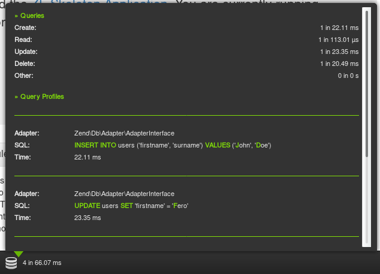

Laminas Db Profiler
========================

A Laminas module to profile db queries using ```\Laminas\Db\Adapter\Profiler\Profiler``` and write them to Laminas\DeveloperTools toolbar



- - -

Features
----

- profiling db queries
- support multiple db connections

Dependencies
------------

- Laminas Db
- Laminas Developer Tools

Instalation
---

- Add following line to your composer.json file ``` "auredg/laminas-db-profiler": "*" ```

- run ```composer update```

- Add module ``` LaminasDbProfiler ``` to your application.config.php

- Enable profiler for your Db Adapter or Adapters

```
'db' => array(
    'driver' => 'Pdo_Mysql',
    'database' => 'db',
    'username' => 'username',
    'password' => 'pass',
    'profiler' => true, //this line enable db profiler
)
```

- Library uses ```Laminas\Db\Adapter\Adapter``` service key. If you are uses different key for your Db Adapter you must set it by configuration options.

Options
-------

Configuration options are available in ```config/laminas-db-profiler.global.php.dist``` file. If you want to change the default ones, copy it in your ```config/autoload``` directory, remove the ```.dist``` extension and edit it.

Options available :

- dbAdapterServiceManagerKey : List of all Db Adapter service manager keys which you want to profile. Laminas\Db\Adapter\Adapter is default
